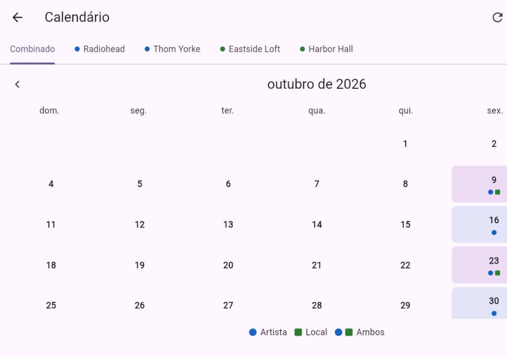
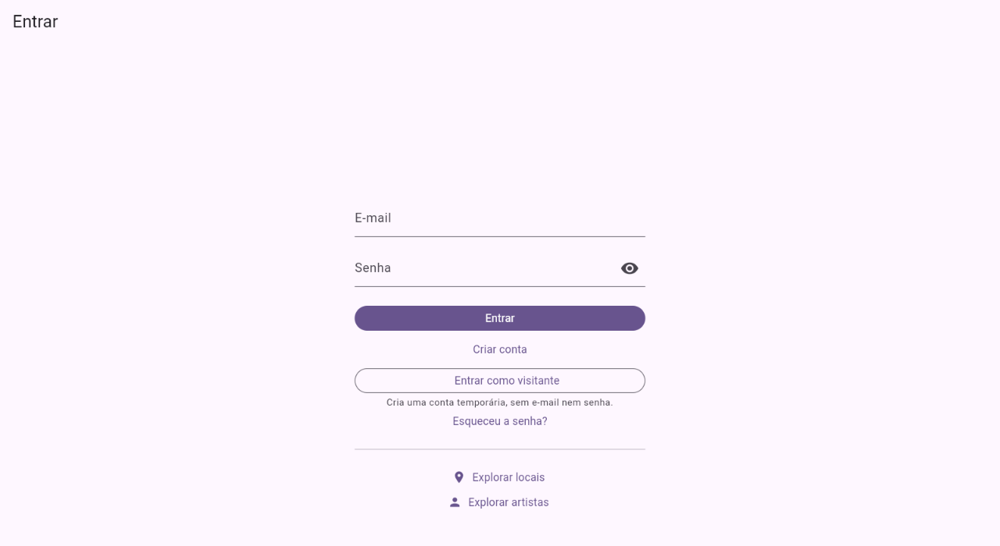
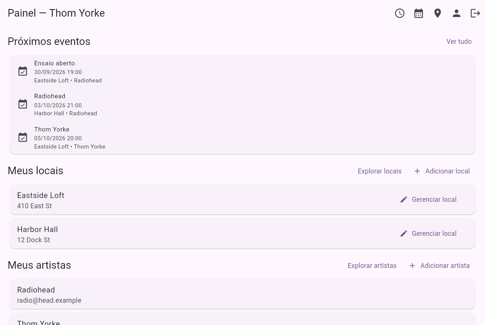
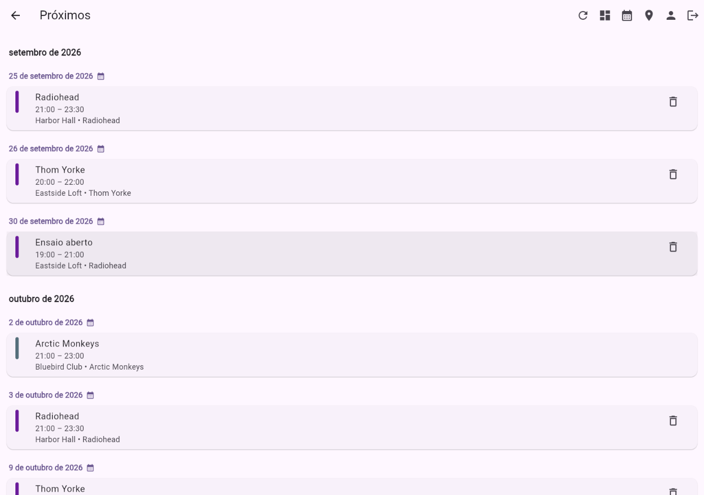
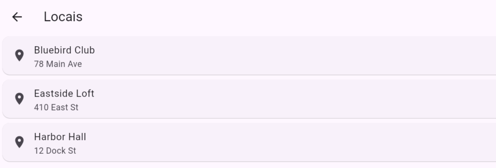
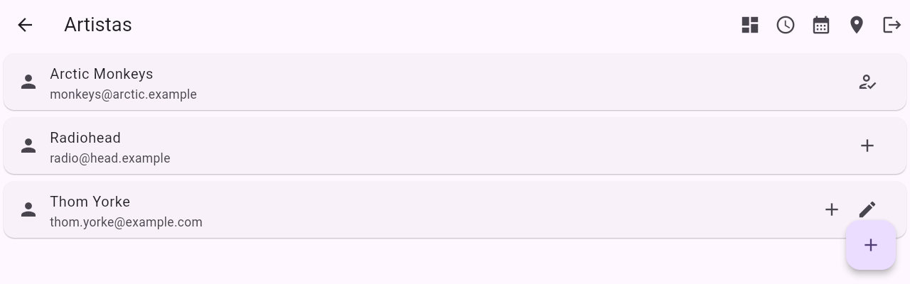

# Acorde

Acorde é uma agenda de eventos para locais e artistas. Serve para um local organizar a
agenda do espaço e para uma banda acompanhar as datas dela, no mesmo calendário.

O nome é a palavra que o próprio app já usa para a visão que junta as duas pontas
(*Combinado*): as notas de um acorde só funcionam afinadas umas com as outras, do mesmo
jeito que um local e quem toca nele dividem um horário. Ele é em português, a língua em
que a interface é escrita, e é o que aparece no app, na aba do navegador e no ícone
instalado. O pacote Dart e os identificadores de publicação são `acorde`.

<p align="center">
  
</p>

## O que o app faz

* Calendário mensal com abas. Uma aba com tudo junto e uma por local ou artista
  vinculado à conta. Clicar num dia abre a lista de eventos daquela data.
* Lista de próximos eventos, agrupada por dia.
* Criação e edição de eventos a partir do calendário, de um local ou de um artista.
  Reservas que se sobrepõem são recusadas: mesmo local, mesmo artista, ou artistas
  que compartilham uma pessoa (um show solo de Thom Yorke não pode ficar em cima de
  um horário do Radiohead).
* Eventos recorrentes, semanal, mensal ou diário, terminando numa data ou depois de
  um número de ocorrências.
* Lista pública de locais e de artistas, com equipe e papéis. Administrador edita o
  cadastro e a equipe; membro só participa. Toda entidade mantém ao menos um
  administrador ativo.
* Convites por e-mail e pedidos de acesso. Com SMTP configurado no servidor
  (`PB_SMTP_*`), o convidado e os administradores recebem aviso; sem isso, tudo fica
  só no painel.
* Cache local dos dados. Sem rede, o app mostra a última informação carregada e
  indica que está desatualizada.
* Horários no fuso de quem está lendo, não no do local. O campo "Fuso horário" do
  cadastro de um local é uma anotação do registro — ele não desloca o que aparece
  na agenda. Duas pessoas em fusos diferentes veem o mesmo evento na hora local de
  cada uma.

## Como rodar

### Com Docker

Só precisa de Docker.

```bash
cp .env.example .env      # defina uma PB_ADMIN_PASSWORD
docker compose up -d --build
```

Abra <http://localhost:8080> e crie uma conta. O primeiro cadastro é um usuário
comum; não existe usuário administrador do app.

A interface de administração do PocketBase fica em <http://127.0.0.1:8090/_/>.

O `docker compose` não sobe sem `PB_ADMIN_PASSWORD`. Não há valor padrão, porque um
valor de exemplo acabaria em produção.

### Local

Precisa do Flutter 3.44.0 e do binário do PocketBase.

```bash
# backend
./pocketbase superuser upsert admin@example.com 'troque-esta-senha'  # só na primeira vez
./pocketbase serve                                                   # 127.0.0.1:8090

# cliente, em outro terminal
flutter pub get
flutter run -d chrome --dart-define=PB_URL=http://127.0.0.1:8090
```

`PB_URL` é lido pelo navegador, então precisa apontar para o backend a partir da
máquina onde o navegador roda. O padrão é vazio, que significa "mesma origem": é o
que o Docker usa, e não serve para `flutter run`.

Para gerar os arquivos estáticos:

```bash
flutter build web --release --dart-define=PB_URL=http://127.0.0.1:8090
# saída em build/web/
```

O binário do PocketBase não está no repositório. Qualquer build 0.38.2 funciona.

## Como usar

### Entrar

<p align="center">
  
</p>

E-mail e senha, ou criar conta. "Esqueceu a senha?" envia um link por e-mail. Isso
depende de o servidor ter SMTP configurado; quando não tem, a tela avisa que a
recuperação não está disponível.

Sem conta dá para abrir as listas de locais e de artistas. Elas são públicas: é assim
que alguém encontra o lugar onde trabalha e depois é convidado. Nessas duas listas a
barra do topo mostra só o que um visitante pode abrir, e no lugar de "Sair" fica o
caminho de volta para a entrada.

Para demonstrar o app sem inventar e-mail e senha, a tela de entrada já traz o botão
"Entrar como visitante": um toque, sem preencher nada. Ele cria uma conta descartável
(endereço no domínio reservado `guest.invalid`, senha gerada) e entra com ela. É uma
conta comum, criada pelo mesmo cadastro público de sempre, sujeita às mesmas regras e
limites.

O botão vem ligado porque isto é um protótipo: um botão de demonstração que só
aparece depois de editar um arquivo não aparece em demonstração nenhuma. Para
desligar, use `PB_GUEST_LOGIN=0` — o botão some sem precisar recompilar. Um
implantação com usuários de verdade deve desligar.

As capturas de tela abaixo são de uma conta de demonstração, com três locais, três
artistas e alguns shows cadastrados. Os dados são fictícios.

### Recuperar a senha

"Esqueceu a senha?" pede o e-mail e manda um link para escolher uma nova senha. O
link abre o app direto na tela de redefinição.

A resposta é sempre a mesma — "se esse endereço tiver uma conta, o link está a
caminho" — inclusive quando não existe conta com aquele e-mail. Isso é de
propósito: uma mensagem que separasse os dois casos diria a qualquer visitante
quais endereços têm conta aqui.

Mandar o link depende de o servidor ter SMTP configurado (`PB_SMTP_*`). Sem isso a
tela avisa que a recuperação não está disponível, e o caminho passa a ser pedir a
um administrador para redefinir a senha.

### Painel

<p align="center">
  
</p>

Tela inicial depois de entrar. Mostra uma prévia dos próximos eventos e as entidades
da conta, separadas em "Meus locais" e "Meus artistas", com o que a conta administra
e o que só acompanha.

É aqui que aparecem os convites pendentes e os pedidos de acesso esperando resposta.

### Calendário

<p align="center">
  
</p>

As abas no topo alternam entre "Combinado" e cada local ou artista.

Clicar num dia abre a lista de eventos daquela data. Se a conta administra a entidade
ou criou os eventos, o mesmo painel permite adicionar e editar; o botão de criar não
aparece quando não há permissão.

As bolinhas embaixo de cada dia marcam o que existe naquela data. A legenda diz o que
cada cor significa.

### Próximos

<p align="center">
  
</p>

Tudo que ainda não terminou, agrupado por dia e ordenado pelo horário de início. Um
evento que já começou e ainda está acontecendo continua na lista.

### Recorrência

Na criação de um evento dá para repeti-lo: todo dia, toda semana ou todo mês,
terminando numa data ou depois de um número de ocorrências. Cada ocorrência vira um
evento próprio, então dá para editar uma sem mexer nas outras.

Excluir um evento que se repete por isso pergunta antes: **somente este** ou **a
série inteira**, com o número de ocorrências no botão. Apagar a série não tem volta,
e apagar uma noite achando que era a série — ou o contrário — é justamente o engano
que essa pergunta existe para evitar.

### Locais e artistas

As duas listas têm a mesma forma, uma para cada ponta da agenda.

<p align="center">
  
  <br>
  
</p>

Listas públicas. Em cada linha:

| Ação | Quando aparece |
|---|---|
| **+** (criar evento) e **lápis** (editar) | A conta administra ou é membro |
| **Solicitar acesso** | A conta ainda não participa |
| **Sua solicitação aguarda aprovação** | Já pediu, e ninguém respondeu ainda |

## Tecnologia

* **Cliente:** Flutter para web (`go_router` + `provider`), compilado em arquivos
  estáticos. Web é a única plataforma; as pastas de Android, iOS, macOS, Windows e
  Linux foram removidas, e `flutter create --platforms=<nome> .` traz qualquer uma de
  volta.
* **Backend:** PocketBase, com SQLite, REST e tempo real. As regras de acesso ficam em
  JavaScript no servidor, não no cliente.
* **Publicação:** dois contêineres. O nginx serve os arquivos estáticos e faz proxy de
  `/api/` para o PocketBase, então o navegador só vê uma origem.

## Documentação

Este arquivo é para usar o app. Arquitetura, decisões de projeto, publicação, testes e
as versões fixas do ferramental estão em [DEVELOPMENT.md](DEVELOPMENT.md), em inglês.

O histórico de mudanças está em [CHANGELOG.md](CHANGELOG.md).

## Licença

Veja [LICENSE.md](LICENSE.md).
